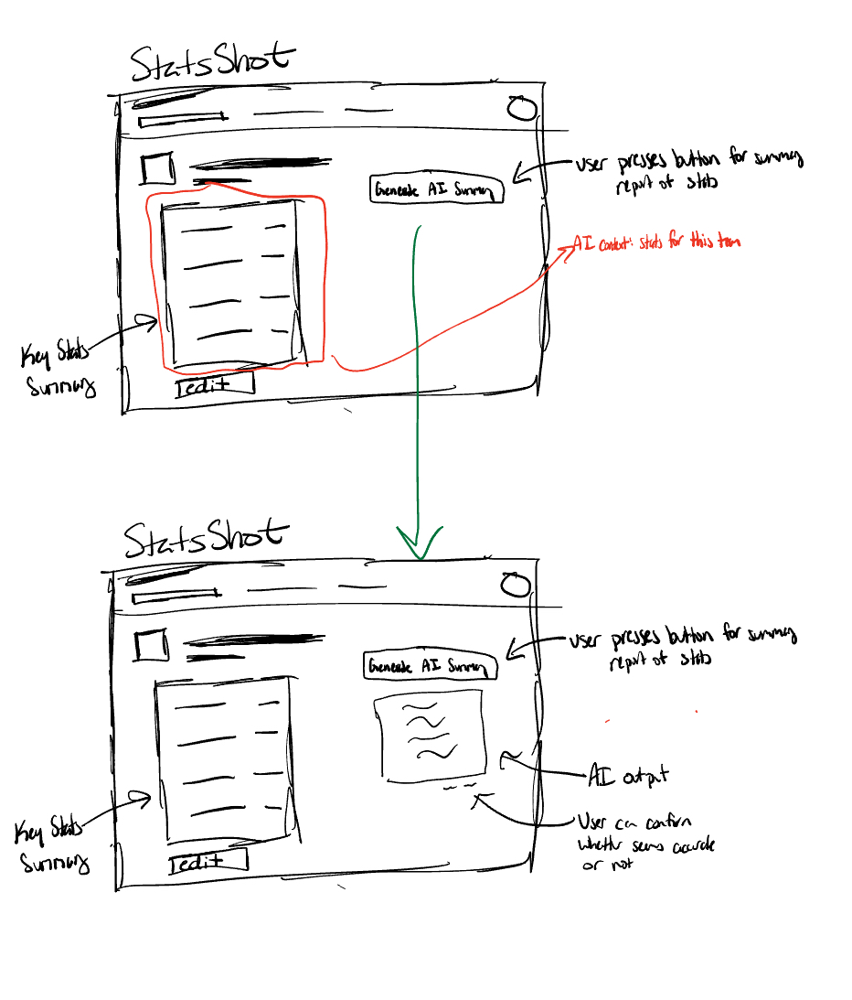

# Assignment 3
## How to run
**Run all test cases** <br>
```
npm start
````
**Run specific test cases** <br>
```
npm run llm  # run only test case for stats for one team
npm run multi-team # run only multi-sport multi-team test
npm run conflict-stats # run only conflicting stats test
````
## Augment the design of a concept
### Original concept
**concept** SportsStats[Source, Stat, Data] <br>
**purpose** store team statistics in a structured way, where each sport defines which stats are tracked and which are considered key <br>
**principle** each sport defines a set of stats relevant to it (with some marked as key); teams belonging to that sport inherit those stat types and maintain their own current values<br>
**state** <br>
&nbsp;&nbsp;&nbsp;&nbsp;&nbsp;&nbsp;
a set of TeamStats with ... <br>
&nbsp;&nbsp;&nbsp;&nbsp;&nbsp;&nbsp;&nbsp;&nbsp;&nbsp;&nbsp;&nbsp;&nbsp;
a name String <br>
&nbsp;&nbsp;&nbsp;&nbsp;&nbsp;&nbsp;&nbsp;&nbsp;&nbsp;&nbsp;&nbsp;&nbsp;
a Sport<br>
&nbsp;&nbsp;&nbsp;&nbsp;&nbsp;&nbsp;
a set of Sports with ... <br>
&nbsp;&nbsp;&nbsp;&nbsp;&nbsp;&nbsp;&nbsp;&nbsp;&nbsp;&nbsp;&nbsp;&nbsp;
a name String <br>
&nbsp;&nbsp;&nbsp;&nbsp;&nbsp;&nbsp;&nbsp;&nbsp;&nbsp;&nbsp;&nbsp;&nbsp;
a Source<br>
&nbsp;&nbsp;&nbsp;&nbsp;&nbsp;&nbsp;&nbsp;&nbsp;&nbsp;&nbsp;&nbsp;&nbsp;
a KeyStats set of Stats<br>
**actions** <br>
&nbsp;&nbsp;&nbsp;&nbsp;&nbsp;&nbsp;
addTeam (teamname: String, sport: Sport): (teamStats: TeamStat)<br>
&nbsp;&nbsp;&nbsp;&nbsp;&nbsp;&nbsp;&nbsp;&nbsp;&nbsp;&nbsp;&nbsp;&nbsp;
**requires** no TeamStats for this teamname with this sport already exists <br>
&nbsp;&nbsp;&nbsp;&nbsp;&nbsp;&nbsp;&nbsp;&nbsp;&nbsp;&nbsp;&nbsp;&nbsp;
**effects** creates a new TeamStats for this teamname for sport<br>
&nbsp;&nbsp;&nbsp;&nbsp;&nbsp;&nbsp;
removeTeam (teamname: String, sport: Sport): (teamStats: TeamStat)<br>
&nbsp;&nbsp;&nbsp;&nbsp;&nbsp;&nbsp;&nbsp;&nbsp;&nbsp;&nbsp;&nbsp;&nbsp;
**requires** TeamStats for this teamname with this sport exists <br>
&nbsp;&nbsp;&nbsp;&nbsp;&nbsp;&nbsp;&nbsp;&nbsp;&nbsp;&nbsp;&nbsp;&nbsp;
**effects** removes TeamStats for this teamname for sport<br>
&nbsp;&nbsp;&nbsp;&nbsp;&nbsp;&nbsp;
addSport (sportName: String, source: Source, default: Set of Stats): (sport: Sport)<br>
&nbsp;&nbsp;&nbsp;&nbsp;&nbsp;&nbsp;&nbsp;&nbsp;&nbsp;&nbsp;&nbsp;&nbsp;
**requires** no Sport with this name exists <br>
&nbsp;&nbsp;&nbsp;&nbsp;&nbsp;&nbsp;&nbsp;&nbsp;&nbsp;&nbsp;&nbsp;&nbsp;
**effects** creates a new Sport with this source with KeyStats set as default<br>
&nbsp;&nbsp;&nbsp;&nbsp;&nbsp;&nbsp;
deleteSport (sportName: String): (sport: Sport)<br>
&nbsp;&nbsp;&nbsp;&nbsp;&nbsp;&nbsp;&nbsp;&nbsp;&nbsp;&nbsp;&nbsp;&nbsp;
**requires** Sport with this name exists and no teams associated with the sport exists<br>
&nbsp;&nbsp;&nbsp;&nbsp;&nbsp;&nbsp;&nbsp;&nbsp;&nbsp;&nbsp;&nbsp;&nbsp;
**effects** removes sportname from state<br>
&nbsp;&nbsp;&nbsp;&nbsp;&nbsp;&nbsp;
addKeyStat (sportName: String, stat: Stat):<br>
&nbsp;&nbsp;&nbsp;&nbsp;&nbsp;&nbsp;&nbsp;&nbsp;&nbsp;&nbsp;&nbsp;&nbsp;
**requires** Sport with this name exists and stat is not already in its KeyStats<br>
&nbsp;&nbsp;&nbsp;&nbsp;&nbsp;&nbsp;&nbsp;&nbsp;&nbsp;&nbsp;&nbsp;&nbsp;
**effects** adds stat to sportName's KeyStats<br>
&nbsp;&nbsp;&nbsp;&nbsp;&nbsp;&nbsp;
removeKeyStat (sportName: String, stat: Stat): <br>
&nbsp;&nbsp;&nbsp;&nbsp;&nbsp;&nbsp;&nbsp;&nbsp;&nbsp;&nbsp;&nbsp;&nbsp;
**requires** Sport with this name exists and stat is in its KeyStats<br>
&nbsp;&nbsp;&nbsp;&nbsp;&nbsp;&nbsp;&nbsp;&nbsp;&nbsp;&nbsp;&nbsp;&nbsp;
**effects** removes stat from sportName's KeyStats<br>
&nbsp;&nbsp;&nbsp;&nbsp;&nbsp;&nbsp;
fetchTeamStats (teamname: String, sport: Sport): (keyStatsData: Map<Stat, Data>)<br>
&nbsp;&nbsp;&nbsp;&nbsp;&nbsp;&nbsp;&nbsp;&nbsp;&nbsp;&nbsp;&nbsp;&nbsp;
**requires** TeamStat for this teamname and sport exists<br>
&nbsp;&nbsp;&nbsp;&nbsp;&nbsp;&nbsp;&nbsp;&nbsp;&nbsp;&nbsp;&nbsp;&nbsp;
**effects** for each KeyStat in sport's KeyStats, fetches Data for this specific team from Sport's Source<br>

### Augmented Concept
**concept** AISportsStats[Source, Stat, Data] <br>
**purpose** store team statistics in a structured way, where each sport defines which stats are tracked and which are considered key <br>
**principle** each sport defines a set of stats relevant to it (with some marked as key); teams belonging to that sport inherit those stat types and maintain their own current values; users can view a team’s current stats and use an LLM to generate an explanatory summary<br>
**state** <br>
&nbsp;&nbsp;&nbsp;&nbsp;&nbsp;&nbsp;
a set of TeamStats with ... <br>
&nbsp;&nbsp;&nbsp;&nbsp;&nbsp;&nbsp;&nbsp;&nbsp;&nbsp;&nbsp;&nbsp;&nbsp;
a name String <br>
&nbsp;&nbsp;&nbsp;&nbsp;&nbsp;&nbsp;&nbsp;&nbsp;&nbsp;&nbsp;&nbsp;&nbsp;
a Sport<br>
&nbsp;&nbsp;&nbsp;&nbsp;&nbsp;&nbsp;&nbsp;&nbsp;&nbsp;&nbsp;&nbsp;&nbsp;
a stats Record<Stat, Data>  // stored locally in this prototype for testing <br>
&nbsp;&nbsp;&nbsp;&nbsp;&nbsp;&nbsp;
a set of Sports with ... <br>
&nbsp;&nbsp;&nbsp;&nbsp;&nbsp;&nbsp;&nbsp;&nbsp;&nbsp;&nbsp;&nbsp;&nbsp;
a name String <br>
&nbsp;&nbsp;&nbsp;&nbsp;&nbsp;&nbsp;&nbsp;&nbsp;&nbsp;&nbsp;&nbsp;&nbsp;
a Source<br>
&nbsp;&nbsp;&nbsp;&nbsp;&nbsp;&nbsp;&nbsp;&nbsp;&nbsp;&nbsp;&nbsp;&nbsp;
a KeyStats set of Stats<br>
**actions** <br>
&nbsp;&nbsp;&nbsp;&nbsp;&nbsp;&nbsp;
addTeam (teamname: String, sport: Sport): (teamStats: TeamStat)<br>
&nbsp;&nbsp;&nbsp;&nbsp;&nbsp;&nbsp;&nbsp;&nbsp;&nbsp;&nbsp;&nbsp;&nbsp;
**requires** no TeamStats for this teamname with this sport already exists <br>
&nbsp;&nbsp;&nbsp;&nbsp;&nbsp;&nbsp;&nbsp;&nbsp;&nbsp;&nbsp;&nbsp;&nbsp;
**effects** creates a new TeamStats for this teamname for sport<br>
&nbsp;&nbsp;&nbsp;&nbsp;&nbsp;&nbsp;
removeTeam (teamname: String, sport: Sport): (teamStats: TeamStat)<br>
&nbsp;&nbsp;&nbsp;&nbsp;&nbsp;&nbsp;&nbsp;&nbsp;&nbsp;&nbsp;&nbsp;&nbsp;
**requires** TeamStats for this teamname with this sport exists <br>
&nbsp;&nbsp;&nbsp;&nbsp;&nbsp;&nbsp;&nbsp;&nbsp;&nbsp;&nbsp;&nbsp;&nbsp;
**effects** removes TeamStats for this teamname for sport<br>
&nbsp;&nbsp;&nbsp;&nbsp;&nbsp;&nbsp;
addSport (sportName: String, source: Source, default: Set of Stats): (sport: Sport)<br>
&nbsp;&nbsp;&nbsp;&nbsp;&nbsp;&nbsp;&nbsp;&nbsp;&nbsp;&nbsp;&nbsp;&nbsp;
**requires** no Sport with this name exists <br>
&nbsp;&nbsp;&nbsp;&nbsp;&nbsp;&nbsp;&nbsp;&nbsp;&nbsp;&nbsp;&nbsp;&nbsp;
**effects** creates a new Sport with this source with KeyStats set as default<br>
&nbsp;&nbsp;&nbsp;&nbsp;&nbsp;&nbsp;
deleteSport (sportName: String): (sport: Sport)<br>
&nbsp;&nbsp;&nbsp;&nbsp;&nbsp;&nbsp;&nbsp;&nbsp;&nbsp;&nbsp;&nbsp;&nbsp;
**requires** Sport with this name exists and no teams associated with the sport exists<br>
&nbsp;&nbsp;&nbsp;&nbsp;&nbsp;&nbsp;&nbsp;&nbsp;&nbsp;&nbsp;&nbsp;&nbsp;
**effects** removes sportname from state<br>
&nbsp;&nbsp;&nbsp;&nbsp;&nbsp;&nbsp;
addKeyStat (sportName: String, stat: Stat):<br>
&nbsp;&nbsp;&nbsp;&nbsp;&nbsp;&nbsp;&nbsp;&nbsp;&nbsp;&nbsp;&nbsp;&nbsp;
**requires** Sport with this name exists and stat is not already in its KeyStats<br>
&nbsp;&nbsp;&nbsp;&nbsp;&nbsp;&nbsp;&nbsp;&nbsp;&nbsp;&nbsp;&nbsp;&nbsp;
**effects** adds stat to sportName's KeyStats<br>
&nbsp;&nbsp;&nbsp;&nbsp;&nbsp;&nbsp;
removeKeyStat (sportName: String, stat: Stat): <br>
&nbsp;&nbsp;&nbsp;&nbsp;&nbsp;&nbsp;&nbsp;&nbsp;&nbsp;&nbsp;&nbsp;&nbsp;
**requires** Sport with this name exists and stat is in its KeyStats<br>
&nbsp;&nbsp;&nbsp;&nbsp;&nbsp;&nbsp;&nbsp;&nbsp;&nbsp;&nbsp;&nbsp;&nbsp;
**effects** removes stat from sportName's KeyStats<br>
&nbsp;&nbsp;&nbsp;&nbsp;&nbsp;&nbsp;
updateStat (teamname: String, sport: Sport, stat: Stat, value: Data): <br>
&nbsp;&nbsp;&nbsp;&nbsp;&nbsp;&nbsp;&nbsp;&nbsp;&nbsp;&nbsp;&nbsp;&nbsp;
**requires** TeamStats for this teamname and sport exist and stat in sport’s KeyStats
&nbsp;&nbsp;&nbsp;&nbsp;&nbsp;&nbsp;&nbsp;&nbsp;&nbsp;&nbsp;&nbsp;&nbsp;
**effects** updates the value of that stat for the specified team
&nbsp;&nbsp;&nbsp;&nbsp;&nbsp;&nbsp;

fetchTeamStats (teamname: String, sport: Sport): (keyStatsData: Map<Stat, Data>)<br>
&nbsp;&nbsp;&nbsp;&nbsp;&nbsp;&nbsp;&nbsp;&nbsp;&nbsp;&nbsp;&nbsp;&nbsp;
**requires** TeamStat for this teamname and sport exists<br>
&nbsp;&nbsp;&nbsp;&nbsp;&nbsp;&nbsp;&nbsp;&nbsp;&nbsp;&nbsp;&nbsp;&nbsp;
**effects** for each KeyStat in sport's KeyStats, fetches Data for this specific team from Sport's Source<br>
&nbsp;&nbsp;&nbsp;&nbsp;&nbsp;&nbsp;
  analyzeTeamPerformance (teamname: String, sport: Sport): (summary: String)<br>
  &nbsp;&nbsp;&nbsp;&nbsp;&nbsp;&nbsp;&nbsp;&nbsp;&nbsp;&nbsp;&nbsp;&nbsp;
    **requires** TeamStats for this teamname and sport exists<br>
&nbsp;&nbsp;&nbsp;&nbsp;&nbsp;&nbsp;&nbsp;&nbsp;&nbsp;&nbsp;&nbsp;&nbsp;
    **effects** calls an LLM using the team’s key stats to produce a textual performance summary
> notes: notes
    In this prototype, stats are stored locally in the TeamStats state and updated manually via `updateStat`.
    In a full implementation, these values would be gathered dynamically from each sport’s external Source (e.g., an API or live database). This concept extends the original SportsStats design by adding an AI-based analysis action that generates readable summaries
    of a team’s performance based on their key stats.
## User Journey


The user opens the StatsShot page for one of their favorited teams, the Philadelphia Phillies. While viewing the key stats, they notice the team's average OPS is listed as .844 along with other key stats, but they aren’t sure what these numbers means. They click the “Generate AI Summary” button beside the stats display, and an AI-generated explanation appears, interpreting the numbers and summarizing how the team is performing this season. After reading the summary, the user can provide quick feedback on whether the explanation seems accurate.

## Prompt Experimentation
Original Prompt:
> You are a sports analyst AI. <br>
  Explain what the following stats suggest about the performance of the `{teamName}` in `{sport.name}`. <br>
  Use clear, conversational language suitable for casual fans. <br>
  Team: `{teamName}` <br>
  Sport: `{sport.name}` <br>
  Stats: `{JSON.stringify(stats, null, 2)}` <br>
  Give a short summary (3–5 sentences). Mention standout metrics or areas to improve.

### AI Test Cases/Experiments

For each, appropriate teams/sports added, stats are updated, then calls for summary for a team using this information.
1. One team with stats: See [`testLLMAnalysis`](./sportsStats-tests.ts#L57-L91)<br>
  - Scenario: One team (Philadelphia Phillies) was added under Baseball with key stats.
  - Result: The generated summary was informative but not within the intended 3–5 sentence range. Instead, the LLM listed each stat individually and then added a short concluding statement.
  - Action to take: Revise the prompt to clearly specify that the entire summary should be limited to 3–5 sentences/ 45-200 words and focus on overall team performance, rather than describing each stat separately.
  - New Prompt:
   ```
You are a professional sports analyst.
Write a single cohesive summary of the team’s performance in 3–5 sentences total (45-200 words).

Integrate all provided statistics into one unified paragraph rather than listing them individually.
Focus on the overall narrative of how the team is performing based on these stats. Focus on key statistics.

Explain what the following stats suggest about the performance of the ${teamName} in ${sport.name}.
Use clear, conversational language suitable for casual fans.

Team: ${teamName}
Sport: ${sport.name}
Stats: ${JSON.stringify(stats, null, 2)}

Mention standout metrics or areas to improve.
```
- Results: More concise responses and summary for this test. Still a bit wordy though.
2. Multiple teams added each with own stats: See [`testMultiTeamAnalysis`](./sportsStats-tests.ts#L97-L144)
  - Scenario: Two sports (Baseball and Basketball) were added. Baseball included two teams, while Basketball included one.
  - Result: The LLM successfully generated distinct summaries for each team without confusing stats between sports. However, similar to the single-team case, it produced list-style summaries (per-stat explanations) instead of a cohesive narrative.
  - Action to take: Clarify in the prompt that the model should produce a unified, paragraph-style summary integrating all key stats, rather than a stat-by-stat breakdown followed by a conclusion. Try to encourage LLM to be as concise as possible.
  - New Prompt:
  ```
  You are a professional sports analyst.
Write a single cohesive summary of the team’s performance in 3–5 sentences total (45-200 words).

Integrate all provided statistics into one unified paragraph rather than listing them individually.
Focus on the overall narrative of how the team is performing based on these stats. Focus on key statistics.

Explain what the following stats suggest about the performance of the ${teamName} in ${sport.name}.

Use clear, conversational language suitable for casual fans. Be as concise as possible while still mention standout metrics or areas to improve along with overall narrative.

Team: ${teamName}
Sport: ${sport.name}
Stats: ${JSON.stringify(stats, null, 2)}
  ```
  - Result: Output was more concise but omitted explicit references to stat abbreviations (e.g., “points per game” instead of “PPG”), which could confuse fans familiar with standard metrics or those who are less familiar with statistics.
3. Conflicting/Inconsistent statistics: See [`testConflictingStats`](./sportsStats-tests.ts#L150-L182)
  - Scenario: The Phillies were given an impossible stat line (OBP = .510, OPS = .480), which violates basic baseball logic since OPS must always exceed OBP (OPS = OBP + SLG and SLG >= 0).
  - Result: The model correctly recognized that one stat appeared strong and the other weak but did not explicitly flag the inconsistency or indicate that the data was unrealistic.
  - Action to Take: Revise the prompt to instruct the LLM to identify and explicitly state any inconsistencies or logical errors in the provided data before summarizing performance. Also, revise from previous prompt that result uses same language as stats (include the actual abbreviations).
  - New Prompt:
  ```
  You are a professional sports analyst.
Write a single cohesive summary of the team’s performance in 3–5 sentences total (45-200 words).

Before writing your 3–5 sentence summary, check if any values are inconsistent or impossible. If such inconsistencies exist, explicitly state that the data may be inaccurate before giving your summary.

Integrate all provided statistics into one unified paragraph rather than listing them individually.
Focus on the overall narrative of how the team is performing based on these stats. Focus on key statistics.

Explain what the following stats suggest about the performance of the ${teamName} in ${sport.name}.

Use clear, conversational language suitable for casual fans. Be as concise as possible while still mention standout metrics or areas to improve along with overall narrative. If writing out statistic names (ex batting avg instead of AVG), say the abbreivation as well.

Team: ${teamName}
Sport: ${sport.name}
Stats: ${JSON.stringify(stats, null, 2)}
  ```
  - Result: The LLM produced a concise summary that immediately called out the inconsistency in the data and included correct abbreviations for statistics, improving both clarity and realism.

## Validators
Even with a clearly defined prompt, an LLM can generate summaries that are logically inconsistent or violate design constraints. Three plausible issues were identified and addressed through validators in the AISportsStats class.

1. Length Deviation – The LLM may produce overly short or excessively long summaries that fall outside the intended 3–5 sentence (≈45–200 word) range. The validator checks the word count and throws an error if the summary is too brief to be meaningful or too long to remain focused.

2. No Key Statistics Mentioned – The LLM might omit key statistics entirely or reference unrelated ones. To address this, a validator ensures that at least one key stat from the input (e.g., OPS, AVG, ERA) is explicitly mentioned.

3. Hallucinated Data or Values – The LLM can occasionally invent statistics not provided in the input (e.g., adding “RBI 120” when RBI was never supplied). A refined validator searches for uppercase tokens (potential stat abbreviations) that include numeric values but are not part of the input list, flagging them as hallucinations only when a number appears near the unrecognized stat.

These checks collectively ensure that the AI-generated summaries remain concise, relevant, and grounded in the data actually provided to the model. They are located in [`validateSummary`](./sportsStats.ts#L184-L213).
